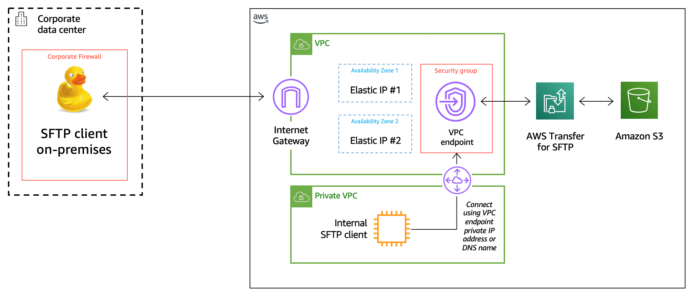

# AWS Transfer Service - Public Facing SFTP Server

Table of Contents
Summary
Diagram
Pre-Requisites
Step-by-step Guide

== Summary
This repo is set up for all templates structured to create a public facing sftp server with ssh keys for access to s3 buckets.

== Diagram

== Pre-Requisites

 - KMS Key
 - SSH Key Pair

== Step-by-step Guide